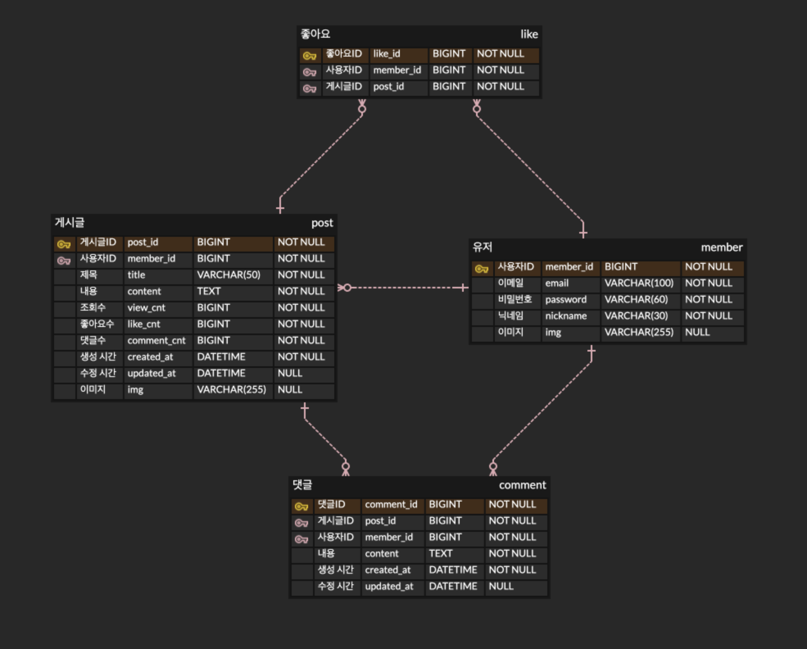

# 2-edwin-kwon-community-be

## 🛠️ Stack

<div style="display:flex;gap:30px;flex-wrap:wrap;">
    
    
    
    
</div>

<br />

## Front-Side
[Front_Github](https://github.com/100-hours-a-week/2-edwin-kwon-community-fe)

## 📝 Description

코코아에서 게시판 기능을 제공하는 서버입니다. Express.js와 MariaDB를 기반으로 구현되었으며, 사용자 인증, 게시글 관리, 댓글, 좋아요 등 다양한 기능을 제공합니다.

## 👨‍💻 Developer

<div align=center>

|                                                           Edwin.kwon (권기현)                                                          |
| :------------------------------------------------------------------------------------------------------------------------: |
| <a href="https://github.com/ghyen"> </a> |

</div>

<br />

## ⚙️ Installation
Step-by-step instructions on how to install and set up the project. Include prerequisites or dependencies.
1. clone repo
```bash
git clone https://github.com/100-hours-a-week/2-edwin-kwon-community-be.git
```

2. install dependencies
```bash
npm install
```

3. set env

make `.env` file and set env like:
```env
# Server
PORT=
NODE_ENV=
HOST=

# DB
DATABASE_URL=
DB_PORT=
DB_HOST=
DB_USER=
DB_PASSWORD=
DB_NAME=

# URL
API_BASE_URL=
FRONTEND_URL=
```

4. run server
```bash
npm start
```
## 👀 Usage
https://github.com/user-attachments/assets/29eb22be-8985-4666-bab3-8b87c423c39f


<br />

## 📁 Packages
```bash
.
├── Dockerfile
├── ERD.png
├── README.md
├── eslint.config.js
├── init.sql
├── package-lock.json
├── package.json
├── prettier.config.js
├── public
│   └── uploads
│       ├── posts
│       └── profiles
│           └── default.jpg
└── src
    ├── app.js
    ├── config
    │   └── session.js
    ├── controllers
    │   ├── commentController.js
    │   ├── controller.js
    │   ├── postController.js
    │   └── userController.js
    ├── middleware
    │   ├── auth.js
    │   ├── dbConnection.js
    │   ├── passwordPolicy.js
    │   ├── rateLimitMiddleware.js
    │   ├── securityMiddleware.js
    │   ├── timeoutMiddleware.js
    │   └── uploadMiddleware.js
    ├── models
    │   ├── commentModel.js
    │   ├── likeModel.js
    │   ├── postModel.js
    │   └── userModel.js
    └── routes
        └── route.js
```
<br />

## 📊 ERD


## ✨ Feature
- **Backend**
  - Node.js
  - Express.js

- **Database**
  - MariaDB

- **Auth**
  - express-session
  - bcrypt (soon)

- **file handling**
  - Multer

## 🌟 Main Features
- **User**
  - Sign up/Login/Logout
  - Profile image upload
  - Nickname update
  - Password change
  - Account deletion

- **Post**
  - Post CRUD operations
  - Image upload
  - View count management

- **Comment**
  - Comment CRUD operations
  - Author information display

- **Like**
  - Post like/unlike
  - Like status check

## 🔗 API Endpoints

### 🔐 Authentication & User
- `GET /users/profile` - Get user profile (Auth required)
- `GET /users/:userId` - Get specific user information
- `GET /auth/check-nickname` - Check nickname availability
- `GET /auth/check-email` - Check email availability
- `POST /auth/signup` - Sign up (Profile upload & Password validation)
- `POST /auth/login` - Login (Password validation)
- `GET /auth/img` - Get profile image (Auth required)
- `POST /auth/logout` - Logout (Auth required)
- `PUT /users/password` - Update password (Auth & Password validation required)
- `DELETE /users` - Delete user account (Auth required)
- `PUT /users` - Update user profile (Auth & Profile upload required)

### 📝 Posts
- `GET /posts` - Get all posts
- `POST /posts` - Create new post (Auth & Post upload required)
- `GET /posts/:postid` - Get specific post
- `DELETE /posts/:postid` - Delete post (Auth required)
- `PUT /posts/:postid` - Update post (Auth required)
- `GET /posts/:postid/like` - Get post likes
- `POST /posts/:postid/like` - Like post (Auth required)
- `DELETE /posts/:postid/like` - Unlike post (Auth required)

### 💬 Comments
- `GET /posts/:postid/comments` - Get all comments for a post
- `POST /posts/:postid/comments` - Create comment (Auth required)
- `PUT /posts/:postid/comments/:commentid` - Update comment (Auth required)
- `DELETE /posts/:postid/comments/:commentid` - Delete comment (Auth required)

### 🧪 Test Endpoints
- `GET /slow` - Test slow response
- `POST /test` - Test POST request
- `PUT /test` - Test PUT request
- `PATCH /test` - Test PATCH request
- `GET /user-nickname/:userid` - Get user nickname by ID
